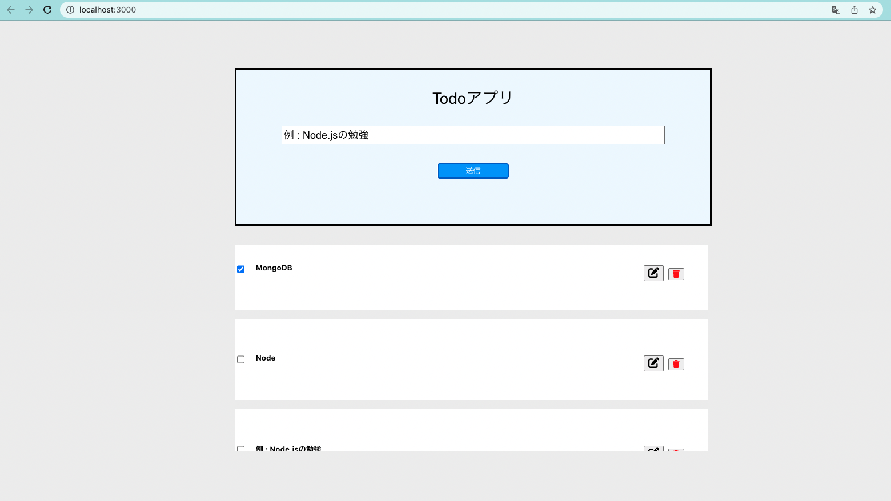

## Todo-app
## Development
Front：React  
BackEnd：Node.js  
Database：MongoDB  

## command
```
$ cd api
$ npm run dev

$ cd front
$ npm start
```
※Api deployment is not assumed. This is a description for doing it locally.

## Example of Appearance
  
